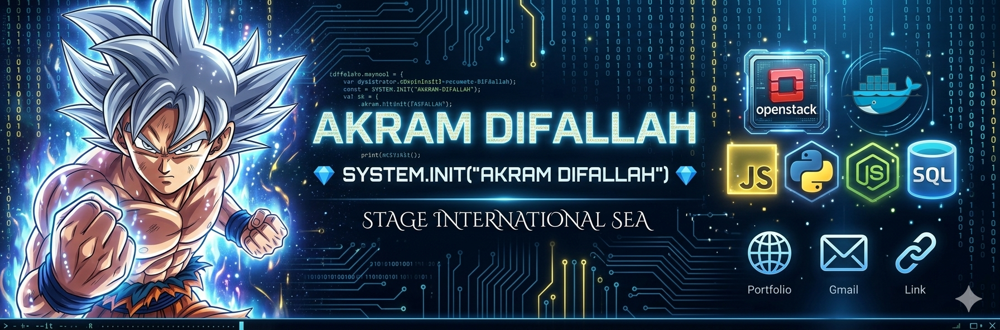

  <!-- High-Definition Production Banner -->
  

<h1 align="center"><code>SYSTEM.INIT("AKRAM DIFALLAH")</code></h1>

  

 

<blockquote>
  <h3>📡 System Overview</h3>
  
<b>Network Engineering & Architecture Operations Core.</b> An optimized operational unit specialized in managing complex cloud infrastructures, backend software engineering, and large-scale data ingestion pipelines.

  <ul>
    <li>🛡️ <b>Core Infrastructure:</b> IaaS OpenStack (MicroStack, SDN Neutron) on Xubuntu, advanced routing, VLANs, and industrial automation protocols (Modbus, TCP/IP).</li>
    <li>📊 <b>Data Management:</b> Designing resilient hybrid storage layers and high-throughput memory cache architectures (PostgreSQL, MongoDB, Cassandra, MySQL).</li>
    <li>🌐 <b>Mission Target:</b> Actively seeking an international technical internship within cloud engineering or network virtualization tracks.</li>
    <li>🎯 <b>Execution Status:</b> <i>"Cold efficiency, flawless execution."</i></li>
  </ul>
</blockquote>

 

### 💻 Tech Stack Ecosystem

#### 🌐 Infrastructures & Cloud Architecture

  

#### 💻 Languages & Frameworks

  

#### 🗄️ Data Engines & ORM

  

#### 🛠️ Environments, Tools & Simulation

  

 

### 🧠 Core Methodologies & Engineering Mindset

* **Systems Thinking** — Architectural approach built on analyzing complete technological pipelines, balancing low-level memory performance with macro resource orchestration.
* **Scalability & Aggregation** — Engineering backend systems capable of batch-processing millions of transactions efficiently without memory saturation through smart caching and query optimization.
* **Network Automation & Inspection** — Proficient in simulating complex topologies, deep packet inspection (Wireshark), and building programmatic infrastructure utilities.

### 🗣️ Linguistics & Certifications

* 🇫🇷 **French** — **B2 Level** *(TCF SO Score: 403)* • Professional operational proficiency.[cite: 1]
* 🇬🇧 **English** — **Intermediate Technical Level** • Fully proficient in interpreting architecture specs and engineering documentation.[cite: 1]

